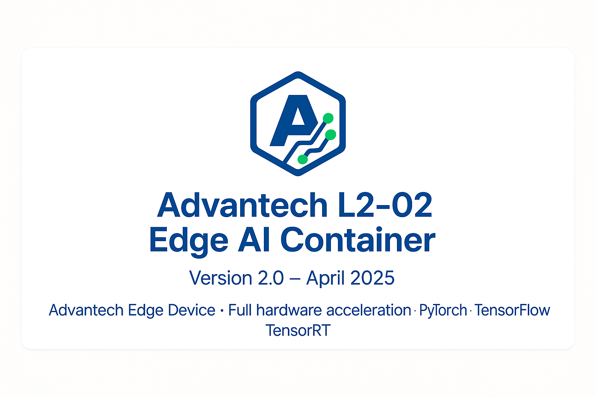

# ACC-L2-02-Edge-AI-enabled-Container

**Version:** 2.0  
**Release Date:** April 2025  
**Copyright:** © 2025 Advantech Corporation. All rights reserved.

## Overview

The Advantech EPC-7300 L2-02 AI Development Container provides a comprehensive environment for building and deploying AI applications on NVIDIA Jetson Orin NX hardware. This container features full hardware acceleration support, optimized AI frameworks, and industrial-grade reliability.

### Key Features

- **Full Hardware Acceleration:** Optimized access to GPU, NVENC/NVDEC, and DLA
- **Complete AI Framework Stack:** PyTorch, TensorFlow, ONNX Runtime, and TensorRT
- **Industrial Vision Support:** Accelerated OpenCV and GStreamer pipelines
- **Edge AI Capabilities:** Support for computer vision, LLMs, and time-series analysis
- **Performance Optimized:** Tuned specifically for Jetson Orin NX 8GB

## Hardware Specifications

| Component | Specification |
|-----------|---------------|
| Target Hardware | Advantech EPC-7300 L2-02 / NVIDIA Jetson Orin NX |
| GPU | NVIDIA Ampere architecture with 1024 CUDA cores |
| DLA Cores | 1 (Deep Learning Accelerator) |
| Memory | 8GB shared GPU/CPU memory |
| JetPack Version | 5.1.1 (L4T R35.2.1) |

## Software Components

| Component | Version | Description |
|-----------|---------|-------------|
| CUDA | 11.4.315 | GPU computing platform |
| cuDNN | 8.6.0 | Deep Neural Network library |
| TensorRT | 8.5.2.2 | Inference optimizer and runtime |
| PyTorch | 2.0.0+nv23.02 | Deep learning framework |
| TensorFlow | 2.12.0+nv23.05 | Machine learning framework |
| ONNX Runtime | 1.16.3 | Cross-platform inference engine |
| OpenCV | 4.5.0 | Computer vision library with CUDA |
| GStreamer | 1.16.2 | Multimedia framework |

## Supported AI Capabilities

### Vision Models

| Model Family | Versions | Performance (FPS) | Quantization Support |
|--------------|----------|-------------------|---------------------|
| YOLO | v3/v4/v5 (up to v5.6.0), v6 (up to v6.2), v7 (up to v7.0), v8 (up to v8.0) | YOLOv5s: 45-60 @ 640x640, YOLOv8n: 40-55 @ 640x640, YOLOv8s: 30-40 @ 640x640 | INT8, FP16, FP32 |
| SSD | MobileNetV1/V2 SSD, EfficientDet-D0/D1 | MobileNetV2 SSD: 50-65 @ 300x300, EfficientDet-D0: 25-35 @ 512x512 | INT8, FP16, FP32 |
| Faster R-CNN | ResNet50/ResNet101 backbones | ResNet50: 3-5 @ 1024x1024 | FP16, FP32 |
| Segmentation | DeepLabV3+, UNet | DeepLabV3+ (MobileNetV2): 12-20 @ 512x512 | INT8, FP16, FP32 |
| Classification | ResNet (18/50), MobileNet (V1/V2/V3), EfficientNet (B0-B2) | ResNet18: 120-150 @ 224x224, MobileNetV2: 180-210 @ 224x224 | INT8, FP16, FP32 |
| Pose Estimation | PoseNet, HRNet (up to W18) | PoseNet: 15-25 @ 256x256 | FP16, FP32 |

### Language Models

| Model Family | Versions | Memory Requirements | Performance Notes |
|--------------|----------|---------------------|-------------------|
| DeepSeek Coder | Mini (1.3B), Light (1.5B) | 2-3 GB | 10-15 tokens/sec in FP16 |
| TinyLlama | 1.1B | 2 GB | 8-12 tokens/sec in FP16 |
| Phi | Phi-1.5 (1.3B), Phi-2 (2.7B) | 1.5-3 GB | Phi-1.5: 8-12 tokens/sec in FP16, Phi-2: 4-8 tokens/sec in FP16 |
| Llama 2 | 7B (Quantized to 4-bit) | 3-4 GB | 1-2 tokens/sec in INT4/INT8 |
| Mistral | 7B (Quantized to 4-bit) | 3-4 GB | 1-2 tokens/sec in INT4/INT8 |

**DeepSeek R1 1.5B Optimizations Recommendations:**
- Supports INT4-8 quantization for inference
- Best performance with TensorRT engine conversion
- Typical throughput: 8-12 tokens/sec in FP16, 12-18 tokens/sec in INT8
- Recommended batch size: 1-2 for real-time applications

## Supported AI Model Formats

| Format | Support Level | Compatible Versions | Notes |
|--------|---------------|---------------------|-------|
| ONNX | Full | 1.10.0 - 1.16.3 | Recommended for cross-framework compatibility |
| TensorRT | Full | 7.x - 8.5.x | Best for performance-critical applications |
| PyTorch (JIT) | Full | 1.8.0 - 2.0.0 | Native support via TorchScript |
| TensorFlow SavedModel | Full | 2.8.0 - 2.12.0 | Recommended TF deployment format |
| TFLite | Partial | Up to 2.12.0 | May have limited hardware acceleration |

## Hardware Acceleration Support

| Accelerator | Support Level | Compatible Libraries | Notes |
|-------------|---------------|----------------------|-------|
| CUDA | Full | PyTorch, TensorFlow, OpenCV, ONNX Runtime | Primary acceleration method |
| TensorRT | Full | ONNX, TensorFlow, PyTorch (via export) | Recommended for inference optimization |
| cuDNN | Full | PyTorch, TensorFlow | Accelerates deep learning primitives |
| NVDEC | Full | GStreamer, FFmpeg | Hardware video decoding |
| NVENC | Full | GStreamer, FFmpeg | Hardware video encoding |
| DLA | Partial | TensorRT | Requires specific model optimization |

### Precision Support

| Precision | Support Level | Compatible Frameworks | Notes |
|-----------|---------------|------------------------|-------|
| FP32 | Full | All | Baseline precision, highest accuracy |
| FP16 | Full | All | 2x memory reduction, minimal accuracy impact |
| INT8 | Partial | TensorRT, ONNX Runtime | 4x memory reduction, requires calibration |
| INT4 | Limited | TensorRT (via plugins) | For models specifically optimized for INT4 |

## Video/Camera Processing

### GStreamer Integration

Built with NVIDIA-accelerated GStreamer plugins supporting:

| Feature | Support Level | Compatible Versions | Notes |
|---------|---------------|---------------------|-------|
| H.264 Encoding | Full | Up to High profile | Hardware accelerated via NVENC |
| H.265/HEVC Encoding | Full | Up to Main10 profile | Hardware accelerated via NVENC |
| VP9 Encoding | Full | Up to Profile 0 | Hardware accelerated |
| AV1 Encoding | Partial | Limited feature set | Experimental support |
| Hardware Decoding | Full | H.264/H.265/VP9 | Via NVDEC |
| RTSP Server | Full | GStreamer RTSP Server 1.16.2 | Streaming capabilities |
| RTSP Client | Full | GStreamer 1.16.2 | Low-latency streaming reception |
| Camera Capture | Full | V4L2, ArgusCamera | Direct camera integration |

## Quick Start Guide

### Installation

```bash
# Clone the repository
git clone https://github.com/Advantech_COE/L2-02
cd L2-02

# Make the build script executable
chmod +x build.sh

# Launch the container
./build.sh
```

### Model Optimization Workflows

For optimal performance, follow these recommended model conversion paths:

#### ONNX Models
```
Original Framework → ONNX → TensorRT Engine
```

#### PyTorch Models
```
PyTorch → TorchScript → ONNX → TensorRT Engine
```
or
```
PyTorch → ONNX → TensorRT Engine
```

#### TensorFlow Models
```
TensorFlow → SavedModel → ONNX → TensorRT Engine
```
or
```
TensorFlow → SavedModel → TensorRT Engine
```

## Best Practices

### Memory Management
- Pre-allocate GPU memory where possible
- Batch inference for better throughput
- Use stream processing for continuous data

### Precision Selection
- Start with FP16 for most models (good balance of accuracy/performance)
- Quantize to INT8 for vision models requiring higher throughput
- Use FP32 only when precision is critical

### Model Optimization
- Optimize model architecture for edge deployment
- Remove training-specific layers
- Apply pruning techniques for smaller models
- Use TensorRT for inference optimization

### Video Processing
- Use hardware-accelerated decoders/encoders
- Process at native resolution when possible
- Consider downsampling for higher throughput

## Known Limitations

1. **LLM Support**: Large language models over 3B parameters are not recommended due to memory constraints.
2. **ONNX Runtime**: Limited GPU acceleration for complex operators.
3. **Mixed Precision**: Some operations may fall back to FP32 even in FP16 mode.
4. **Display Acceleration**: X11 forwarding performance may be limited.
5. **ONNX Runtime GPU Support**: For optimal performance, convert ONNX models to TensorRT engines.


Copyright © 2025 Advantech Corporation. All rights reserved.
